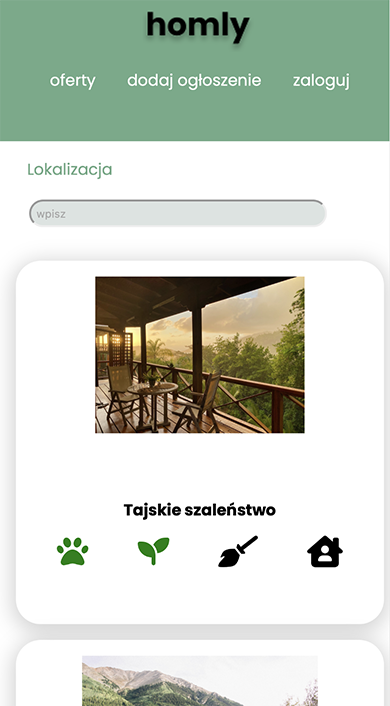

# homly

> Website for people who are looking for a home for performing simple household activities

## Table of contents

* [About website](#about-website)
* [Technologies Used](#technologies-used)
* [Features](#features)
* [Screenshots](#screenshots)
* [Launch](#launch)

## About website

This website allows you to post your property for temporary use and specify any desired tasks in exchange. Browse and
connect with potential guests, and experience a unique and authentic way to travel.

## Technologies Used

### Front

- HTML
- CSS
- JS

### Back

- PHP

### Database

- PostGreSQL

### Other

- Docker
- Git
- NGINX

## Features

These are the most important features:

- Owner can publish his house and specify from several categories what he expects in the property
- Viewer can browse the offers, filter them by date and then choose the offer he is interested in
- There is also an option for the administrator to view all offers, not just those that are not booked yet

## Screenshots
There are some screenshots from my website.

## Launch

**!!! To launch this project you need to open Docker Application !!!**

1. Download project
2. Run `docker-compose up` in main directory
3. Wait for the needed containers to be created
4. After that you should be able to run website in your browser. Type `localhost:8080` in searchbar
5. Enjoy :)

